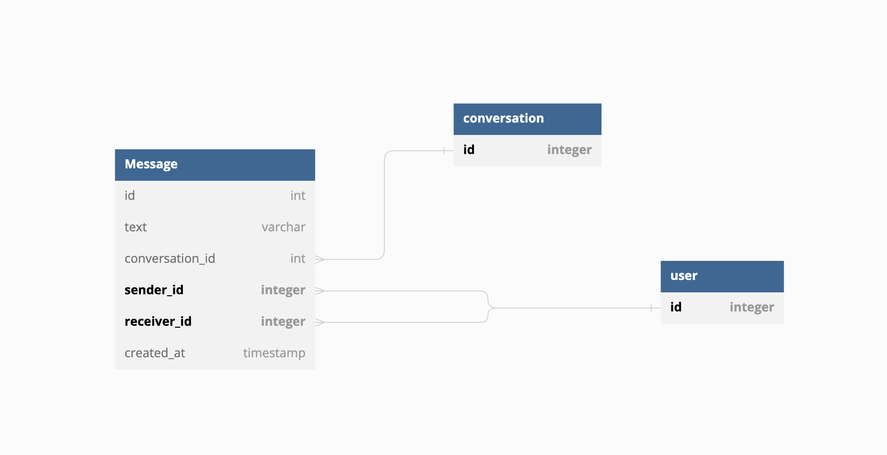

# CRM API Documentation

## Introduction
a monolithic system for a simple chat application written in Typescript. 

## Technologies Used
- Node.js 16 or higher with Typescript
- npm (Node Package Manager) for managing dependencies
- PostgreSQL as the database system
- Sequelize ORM for interacting with the database
- Docker for containerization
- Jest for unit testing
- Axios for making external API calls

## API Endpoints

### Create Contact
- HTTP Method: POST
- Endpoint: `/contacts`
- Description: Create a new contact with their personal information.
- Request Body:
  - Name: string
  - Email: string
- Response:
  - Contact details (created contact object)

### List Contacts
- HTTP Method: GET
- Endpoint: `/contacts`
- Description: Retrieve a list of all contacts.
- Response:
  - List of contact objects

### Send Message
- HTTP Method: POST
- Endpoint: `/messages`
- Description: Send a message to a contact.
- Request Body:
  - SenderId: number
  - ReceiverId: number
  - Text: string (message content)
- Response:
  - Message details (created message object)

### Webhook
- HTTP Method: POST
- Endpoint: `/webhook`
- Description: Receive messages from an external service via a webhook.

### Get Conversation Messages
- HTTP Method: GET
- Endpoint: `/messages/:senderId/:receiverId`
- Description: Retrieve all messages in a conversation between two contacts.
- Response:
  - List of message objects

### Get All Conversations Messages
- HTTP Method: GET
- Endpoint: `/allMessages/:contactId`
- Description: Retrieve all conversations and their messages for a specific contact.
- Response:
  - List of conversation objects, each containing the associated messages

## Database Schema

### Contact
- id: number (primary key)
- name: string
- email: string
- createdAt: Date
- updatedAt: Date

### Conversation
- id: number (primary key)
- createdAt: Date
- updatedAt: Date

### Message
- id: number (primary key)
- text: string
- conversationId: number (foreign key)
- senderId: number (foreign key)
- receiverId: number (foreign key)
- createdAt: Date
- updatedAt: Date

## Deployment Instructions
step-by-step instructions for deploying the CRM API service:

1. Clone the project repository
2. Install dependencies with `npm install`
3. Start the application with `npm run start`
4. Access the API endpoints at the specified routes

also you can use `docker-compose up` for run the Docker containers. 
## Testing and Quality Assurance

- Unit tests: a sample of unit test for contact controller. 

for running test you can use `npm test`.

## API Documentation
You can find the Postman Collection for this API [here](./superchat.postman_collection.json).